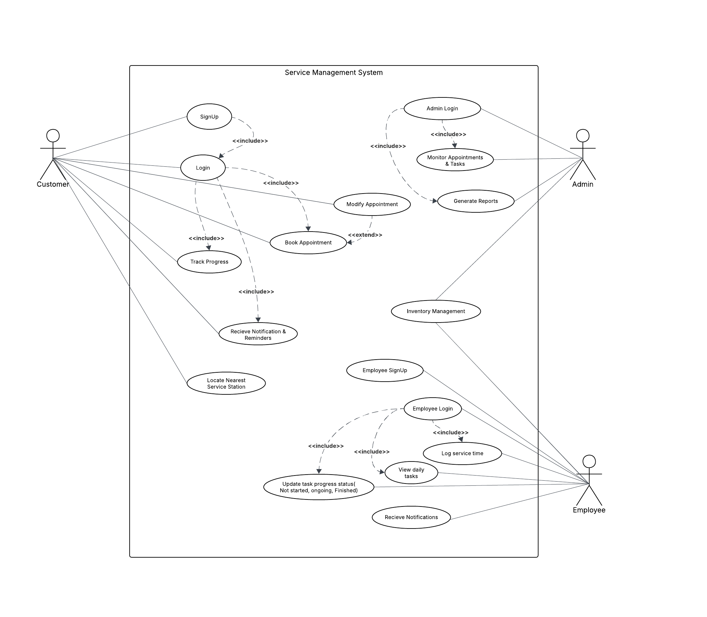
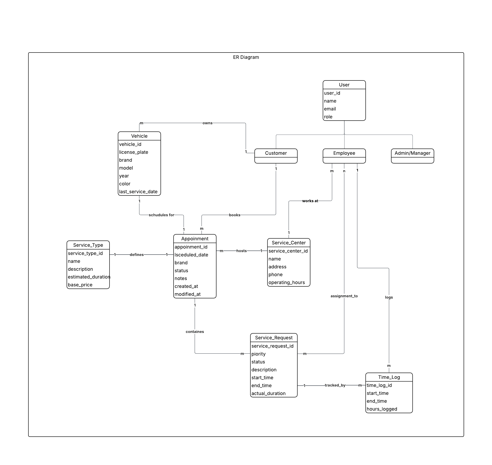

<div align="center">

# 🚗 EAD Automobile Service Management System

**Automobile Service Time Logging & Appointment System**

[](https://opensource.org/licenses/MIT)
[](https://spring.io/projects/spring-boot)
[](https://reactjs.org/)
[](https://www.oracle.com/java/)
[](https://www.typescriptlang.org/)
[](https://www.postgresql.org/)

*A comprehensive enterprise application for managing automotive service appointments, time logging, and customer interactions*

[Features](#-key-features) • [Tech Stack](#-technology-stack) • [Getting Started](#-getting-started) • [Documentation](#-system-diagrams) • [License](#-license)

</div>

---

## 📋 Project Overview

This is an **Enterprise Application Development (EAD)** project that implements a comprehensive automobile service management system. The system streamlines the process of managing vehicle service appointments, tracking service progress, and logging service times for automotive service centers and their customers.

### 🎯 Project Objectives

- ✅ Develop a web-based automobile service management system
- ✅ Implement appointment booking and scheduling functionality
- ✅ Create service time logging and tracking capabilities
- ✅ Provide real-time status updates for customers
- ✅ Enable efficient management of service center operations
- ✅ Demonstrate enterprise application development best practices

## 📊 System Diagrams

<details>
<summary><b>Use Case Diagram</b></summary>



</details>

<details>
<summary><b>Entity Relationship Diagram</b></summary>



</details>

## ✨ Key Features

### 👥 Customer Portal
- 🔐 **User Registration & Authentication**: Secure login system with OAuth2 (Google) support
- 🚙 **Vehicle Management**: Add and manage multiple vehicles with details
- 📅 **Appointment Booking**: Schedule service appointments online with real-time availability
- 📜 **Service History**: View comprehensive past and current service records
- 🔔 **Real-time Status Tracking**: Monitor service progress with live updates
- 📧 **Notifications**: Receive updates on service status

### 👨‍🔧 Employee Dashboard
- 📊 **Staff Dashboard**: Manage daily operations and appointments efficiently
- ⏱️ **Service Time Logging**: Track actual time spent on services with precision
- 📋 **Appointment Management**: View, update, and manage customer appointments
- 🔄 **Service Status Updates**: Real-time updates to customers on service progress
- 👤 **Profile Management**: Manage employee profiles and preferences

### 🔧 Administrative Functions
- 👤 **User Management**: Manage customer and staff accounts
- 📈 **Analytics & Reports**: View system analytics and performance metrics
- 🛠️ **Service Catalog**: Maintain service types and configurations
- 📦 **Inventory Management**: Track parts and supplies
- 🔔 **Notification Center**: Centralized notification management
- ⚙️ **System Configuration**: Configure system settings and parameters

## 🏗️ System Architecture

### 💻 Technology Stack

#### Frontend
- **Framework**: React 19.1.1 with TypeScript
- **Build Tool**: Vite 7.1.2
- **Styling**: TailwindCSS 4.1.13
- **Routing**: React Router DOM 7.9.3
- **UI Components**: Radix UI, Lucide React
- **Maps**: Leaflet & React-Leaflet
- **HTTP Client**: Axios 1.12.2
- **Features**: Responsive design, real-time updates, intuitive UI

#### Backend
- **Framework**: Spring Boot 3.5.5
- **Language**: Java 21
- **Database**: PostgreSQL
- **ORM**: Spring Data JPA
- **Security**: Spring Security with JWT authentication
- **OAuth2**: Google OAuth2 integration
- **Architecture**: RESTful API, Layered Architecture (Controller → Service → Repository)
- **Build Tool**: Maven

#### Database
- **Primary Database**: PostgreSQL
- **Design**: Normalized relational database schema
- **Key Entities**: User, Vehicle, Appointment, TimeLog, RefreshToken, PasswordResetToken
- **Features**: Data integrity, ACID compliance, indexing for performance

#### Security & Authentication
- 🔒 JWT-based authentication with refresh tokens
- 🔐 Role-based access control (RBAC)
- 🌐 OAuth2 integration (Google Sign-In)
- 🛡️ Password encryption and secure token management
- 🚫 XSS and CSRF protection

#### DevOps & Deployment
- 🐳 Docker & Docker Compose support
- 📦 Containerized microservices architecture
- 🔄 Environment-based configuration (.env files)

## 👥 User Roles

| Role | Capabilities |
|------|-------------|
| 👤 **Customer** | Book appointments, track services, manage vehicles, view service history |
| 👨‍🔧 **Employee** | Log service times, update service status, manage appointments |
| 👔 **Admin** | System administration, user management, analytics, inventory management |

## 🚀 Getting Started

### Prerequisites

**Required Software:**
- ☕ Java 21 or higher
- 🐘 PostgreSQL 14 or higher
- 📦 Node.js 18+ and npm/yarn
- 🐳 Docker and Docker Compose (for containerized deployment)
- 🔧 Maven 3.8+ (for backend build)

### 🔧 Installation & Setup

#### Option 1: Docker Compose (Recommended)

```bash
# Clone the repository
git clone https://github.com/Team-Tensors/EAD-Automobile-Service-Management-System.git
cd EAD-Automobile-Service-Management-System

# Start all services with Docker Compose
docker-compose up --build

# Access the application
# Frontend: http://localhost:5173
# Backend API: http://localhost:4000
```

#### Option 2: Manual Setup

**Backend Setup:**

```bash
# Navigate to backend directory
cd backend

# Create .env file from example
cp .env.example .env
# Edit .env file with your database credentials and configuration

# Build the application
mvn clean install

# Run the application
mvn spring-boot:run

# Backend will be available at http://localhost:4000
```

**Frontend Setup:**

```bash
# Navigate to frontend directory
cd frontend

# Install dependencies
npm install

# Start development server
npm run dev

# Frontend will be available at http://localhost:5173
```

### 🗄️ Database Setup

```sql
-- Create PostgreSQL database
CREATE DATABASE automobile_service_db;

-- The application will automatically create tables on first run
-- using JPA/Hibernate auto-ddl configuration
```

### ⚙️ Environment Configuration

**Backend (.env file):**
```env
DB_URL=jdbc:postgresql://localhost:5432/automobile_service_db
DB_USERNAME=your_username
DB_PASSWORD=your_password

GOOGLE_CLIENT_ID=your_google_client_id
GOOGLE_CLIENT_SECRET=your_google_client_secret

FRONTEND_URL=http://localhost:5173

JWT_SECRET=your_jwt_secret_key_at_least_256_bits
JWT_EXPIRATION=86400000
JWT_REFRESH_EXPIRATION=604800000
JWT_REFRESH_MAX_TOKENS=5
```

### 🧪 Running Tests

```bash
# Backend tests
cd backend
mvn test

# Frontend tests (if configured)
cd frontend
npm test
```

## 📁 Project Structure

```
EAD-Automobile-Service-Management-System/
├── backend/                    # Spring Boot backend
│   ├── src/
│   │   ├── main/
│   │   │   ├── java/com/ead/backend/
│   │   │   │   ├── controller/      # REST API controllers
│   │   │   │   ├── service/         # Business logic layer
│   │   │   │   ├── repository/      # Data access layer
│   │   │   │   ├── entity/          # JPA entities
│   │   │   │   ├── dto/             # Data transfer objects
│   │   │   │   ├── config/          # Configuration classes
│   │   │   │   ├── exception/       # Exception handlers
│   │   │   │   ├── filter/          # Security filters
│   │   │   │   └── util/            # Utility classes
│   │   └── test/                    # Unit and integration tests
│   ├── pom.xml                      # Maven dependencies
│   └── Dockerfile                   # Backend Docker configuration
├── frontend/                   # React frontend
│   ├── src/
│   │   ├── pages/                   # Page components
│   │   │   ├── admin/               # Admin dashboard pages
│   │   │   └── ...                  # Customer & Employee pages
│   │   ├── components/              # Reusable UI components
│   │   ├── services/                # API service layer
│   │   ├── types/                   # TypeScript type definitions
│   │   └── utils/                   # Utility functions
│   ├── package.json                 # npm dependencies
│   └── Dockerfile                   # Frontend Docker configuration
├── diagrams/                   # System design diagrams
├── documents/                  # Project documentation
├── docker-compose.yml          # Docker Compose configuration
└── README.md                   # This file
```

## 📚 API Documentation

The backend provides a RESTful API with the following main endpoints:

### Authentication
- `POST /api/auth/signup` - User registration
- `POST /api/auth/login` - User login
- `POST /api/auth/refresh` - Refresh access token
- `POST /api/auth/logout` - User logout
- `POST /api/auth/forgot-password` - Request password reset
- `POST /api/auth/reset-password` - Reset password with token

### User Management
- `GET /api/auth/profile` - Get user profile
- `PUT /api/auth/profile` - Update user profile

### Employee Operations
- `GET /api/employee/appointments` - Get appointments for employee
- `POST /api/employee/time-logs` - Create time log entry
- Additional employee-specific endpoints

### Health Check
- `GET /api/health` - Service health status

## 🤝 Contributing

We welcome contributions to improve the EAD Automobile Service Management System! Here's how you can contribute:

1. 🍴 Fork the repository
2. 🌿 Create a feature branch (`git checkout -b feature/AmazingFeature`)
3. 💾 Commit your changes (`git commit -m 'Add some AmazingFeature'`)
4. 📤 Push to the branch (`git push origin feature/AmazingFeature`)
5. 🔄 Open a Pull Request

Please ensure your code follows the project's coding standards and includes appropriate tests.

## 👨‍💻 Team

**Team Tensors** - Enterprise Application Development Project

For questions or support, please open an issue in the GitHub repository.

## 📄 License

<div align="center">

### MIT License

Copyright (c) 2025 Team Tensors

Permission is hereby granted, free of charge, to any person obtaining a copy
of this software and associated documentation files (the "Software"), to deal
in the Software without restriction, including without limitation the rights
to use, copy, modify, merge, publish, distribute, sublicense, and/or sell
copies of the Software, and to permit persons to whom the Software is
furnished to do so, subject to the following conditions:

The above copyright notice and this permission notice shall be included in all
copies or substantial portions of the Software.

**THE SOFTWARE IS PROVIDED "AS IS", WITHOUT WARRANTY OF ANY KIND, EXPRESS OR
IMPLIED, INCLUDING BUT NOT LIMITED TO THE WARRANTIES OF MERCHANTABILITY,
FITNESS FOR A PARTICULAR PURPOSE AND NONINFRINGEMENT. IN NO EVENT SHALL THE
AUTHORS OR COPYRIGHT HOLDERS BE LIABLE FOR ANY CLAIM, DAMAGES OR OTHER
LIABILITY, WHETHER IN AN ACTION OF CONTRACT, TORT OR OTHERWISE, ARISING FROM,
OUT OF OR IN CONNECTION WITH THE SOFTWARE OR THE USE OR OTHER DEALINGS IN THE
SOFTWARE.**

---

[](https://opensource.org/licenses/MIT)

*This project is licensed under the MIT License - see above for details*

</div>

## 🙏 Acknowledgments

- Spring Boot team for the excellent framework
- React team for the powerful UI library
- All contributors and team members who made this project possible

---

<div align="center">

**Last Updated**: October 2025

Made with ❤️ by Team Tensors

[⬆ Back to Top](#-ead-automobile-service-management-system)

</div>
